# CouchEditor Math Functions

Technical reference for the CPU image-processing stages used by the pipeline. The primary implementations are in [src/lib/utils.ts](src/lib/utils.ts); LUT processing is in [src/lib/lut.ts](src/lib/lut.ts), and UI ranges are configured in [src/pipeline/NodePalette.tsx](src/pipeline/NodePalette.tsx).

## Runtime model

Every stage receives an `ImageData` object and mutates `image.data` in place. Pixels are stored as RGBA bytes:

- RGB channels are normally in `0..255`.
- Alpha is not modified by the stages in this reference.
- Assignments to `Uint8ClampedArray` round and clamp fractional or out-of-range RGB results. Explicit `clamp()` calls use the same `0..255` bounds.
- A UI range describes the current node controls. The implementation domain describes what the function itself does if called directly with another value.

The luminance constants used throughout are:

$$Y = 0.2126R + 0.7152G + 0.0722B$$

These are Rec. 709-style luma weights applied to byte-valued channels unless noted otherwise.

## Quick index

| Group | Stages |
| --- | --- |
| Light | Exposure, brightness, contrast, highlights, shadows, gamma, luminosity, whites/blacks, RGB black point, RGB white point, RGB midtones |
| Color | Saturation, vibrance, hue rotation, black and white, sepia, temperature/tint, split toning |
| Detail | Sharpen, grain |
| Effects | Vignette, HDR effect, pop, fade |
| Film | Film-base remover and film-base detection helper |
| LUT | `.cube` 1D and 3D LUT sampling |
| Fixed transforms | Invert |

## Light stages

### `exposureStage(exposureEV)`

**Node:** `exposure` | **UI range:** `-3..3`, step `0.1`, default `0` EV.

Exposure applies a photographic exposure multiplier:

$$f = 2^{EV}, \qquad C' = C f$$

A 1 EV increase doubles each channel; a 1 EV decrease halves it. The implementation precomputes a 256-entry LUT. The function accepts any finite numeric EV in principle, while very large values saturate the byte output. Alpha is preserved.

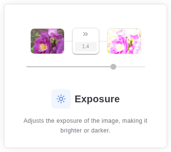

---

### `brightnessStage(amount)`

**Node:** `brightness` | **UI range:** `-100..100`, step `1`, default `0`.

Adds the same offset to each RGB channel:

$$C' = C + amount$$

The implementation uses a byte LUT, so output is rounded and clamped on assignment. Direct calls can provide values outside the UI range, but the result still becomes a byte. Alpha is preserved.

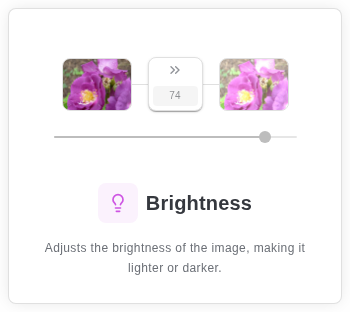

---

### `contrastStage(amount)`

**Node:** `contrast` | **UI range:** `-100..100`, step `1`, default `0`.

Uses the classic contrast factor:

$$k = \frac{259(amount + 255)}{255(259 - amount)}, \qquad C' = k(C - 128) + 128$$

The UI keeps `amount` below the singularity at `259`. The implementation does not clamp `amount` itself; direct values near `259` can create very large results, and values at `259` cause division by zero. The byte LUT clamps and rounds output.

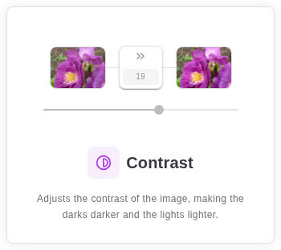

---

### `highlightsStage(amount)`

**Node:** `highlights` | **UI range:** `-100..100`, step `1`, default `0`.

For luminance normalized to byte space, the highlight weight is:

$$w = (Y/255)^2(amount/100)$$

For non-negative amounts, channels move toward white:

$$C' = C + (255-C)w$$

For negative amounts, channels are reduced proportionally:

$$C' = C + Cw$$

The implementation does not clamp `amount`; byte assignment clamps/rounds the result. Alpha is preserved.

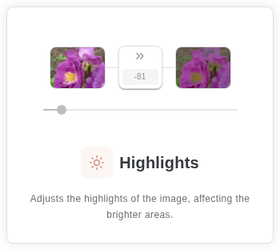

---

### `shadowsStage(amount)`

**Node:** `shadows` | **UI range:** `-100..100`, step `1`, default `0`.

The shadow emphasis uses the inverse luminance:

$$w = ((255-Y)/255)^2(amount/100)$$

Positive values lift shadows toward white, while negative values reduce them:

$$C' = C + (255-C)w \quad (amount \ge 0)$$

$$C' = C + Cw \quad (amount < 0)$$

The parameter is not clamped by the function. RGB byte writes clamp/round; alpha is preserved.

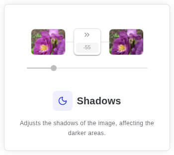

---

### `gammaStage(gamma)`

**Node:** `gamma` | **UI range:** `0.1..3`, step `0.01`, default `1`.

Applies a normalized power curve:

$$C' = 255(C/255)^\gamma$$

A gamma below `1` lightens midtones; a gamma above `1` darkens them. The implementation does not validate gamma. Zero and negative values are accepted by JavaScript's power operation but may produce non-photographic or non-finite results; the UI keeps the value positive. The LUT clamps and rounds output.

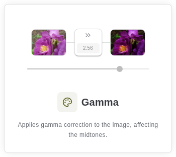

---

### `luminosityStage(strength)`

**Node:** `luminosity` | **UI range:** `0..2`, step `0.05`, default `0`.

Blends the original color with its luma-gray equivalent:

$$C' = C(1-s) + Ys$$

The UI permits `s > 1`, which intentionally extrapolates beyond a simple blend. The implementation accepts any number and does not explicitly clamp it; byte assignment clamps/rounds. Alpha is preserved.

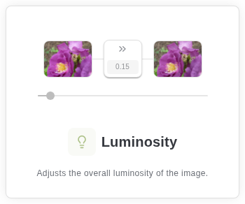

---

### `whitesBlacksStage(whites, blacks)`

**Node:** `whites-blacks` | **UI ranges:** `whites 0..100`, `blacks 0..100`, step `1`, both default `0`.

The stage first lifts or lowers every channel by `whites`, clamps that intermediate value, then subtracts `blacks` and clamps again:

$$C' = clamp(clamp(C + whites) - blacks)$$

A zero/zero pair returns a no-op stage. Direct calls accept any numbers, although negative values are outside the UI contract. Output uses a byte LUT.

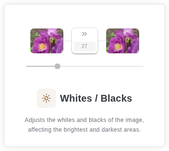

---

### `rgbBlackPointStage(blackR, blackG, blackB)`

**Node:** `rgb-black-point` | **UI range:** each channel `0..255`, step `1`, default `0`.

$$C'_c = 255\frac{C_c - black_c}{255-black_c}$$

The denominator is floored at `1`, and the LUT explicitly rounds and clamps. Inputs below the black point map to zero; inputs above the point are stretched toward white. The function does not clamp the black-point parameters before building the LUT.

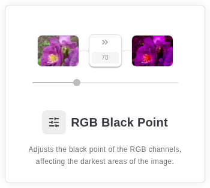

---

### `rgbWhitePointStage(whiteR, whiteG, whiteB)`

**Node:** `rgb-white-point` | **UI range:** each channel `0..255`, step `1`, default `255`.

$$C'_c = 255\frac{C_c}{white_c}$$

White-point parameters are floored at `1` to prevent division by zero. The LUT rounds and clamps output. Alpha is preserved by both stages.

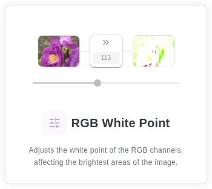

---

### `rgbMidtonesStage(gammaR, gammaG, gammaB)`

**Node:** `rgb-midtones` | **UI ranges:** each channel `0.1..3`, step `0.01`, default `1`.

Applies an independent gamma curve to red, green, and blue:

$$C'_c = 255(C_c/255)^{gamma_c}$$

The implementation accepts direct values outside the UI range without validation. Each channel uses its own byte LUT, so output is rounded/clamped.

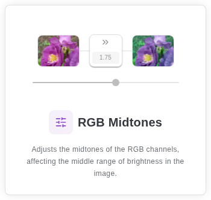

---

## Color stages

### `saturationStage(amount)`

**Node:** `saturation` | **UI range:** `-100..100`, step `1`, default `0`.

With `k = 1 + amount/100`, saturation is adjusted around luminance:

$$C' = kC + (1-k)Y$$

Negative values desaturate; `-100` produces grayscale. The function does not clamp `amount`; byte assignment clamps/rounds. Alpha is preserved.

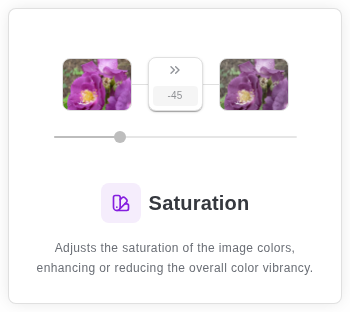

---

### `vibranceStage(amount)`

**Node:** `vibrance` | **UI range:** `0..100`, step `1`, default `0`.

Vibrance selectively boosts channels based on the pixel's maximum channel. With `A=(R+G+B)/3`, saturation estimate `s=(max-A)/max`, and `k=amount/100(1-s)`:

$$C' = C + (C-A)k$$

Black pixels use `s=0` to avoid division by zero. The implementation accepts negative or greater-than-100 values directly; byte output clamps/rounds.

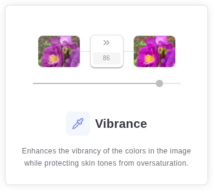

---

### `hueRotationStage(amount)`

**Node:** `hue-rotation` | **UI range:** `-180..180` degrees, step `1`, default `0`.

Converts each non-gray pixel from RGB to HSL, adds a normalized rotation, and converts back:

$$h' = (h + (amount \bmod 360)/360) \bmod 1$$

Gray pixels (`max == min`) are unchanged because hue is undefined. The function normalizes arbitrary degree values modulo `360`; RGB writes clamp/round through `ImageData`.

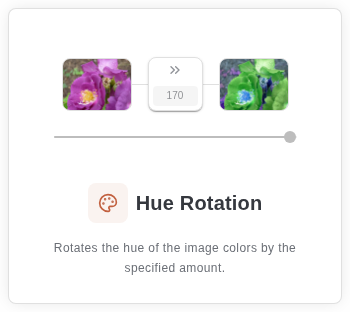

---

### `blackAndWhiteStage()`

**Node:** `black-white` | **UI:** no numeric input.

Replaces all three RGB channels with the luma value `Y`. The luma result is written to the byte array and therefore rounded/clamped. Alpha is preserved.

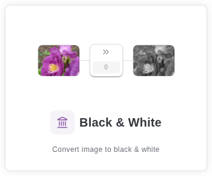

---

### `sepiaStage()`

**Node:** `sepia` | **UI:** no numeric input.

Applies a fixed 3x3 channel transform:

$$\begin{aligned}R' &= 0.393R + 0.769G + 0.189B\\G' &= 0.349R + 0.686G + 0.168B\\B' &= 0.272R + 0.534G + 0.131B\end{aligned}$$

The output is byte-clamped and rounded by `ImageData`; alpha is preserved.

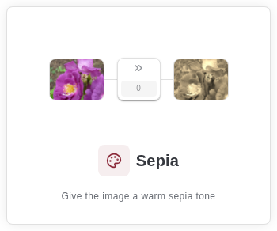

---

### `temperatureTintStage(temp, tint)`

**Node:** `temperature-tint` | **UI ranges:** temperature and tint each `-100..100`, step `1`, default `0`.

Builds independent channel offsets:

$$\Delta R=0.6temp+0.15tint,\quad \Delta G=0.5tint,\quad \Delta B=-0.6temp+0.15tint$$

Then applies `C'=C+Delta` through per-channel LUTs. The function accepts direct values outside the UI range; output is rounded/clamped.

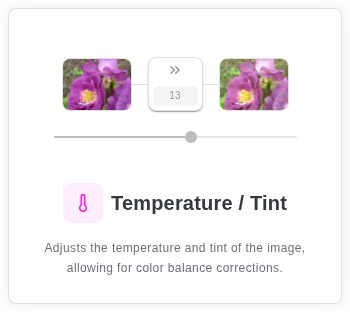

---

### `splitToningStage(shadowTint, highlightTint, strength)`

**Node:** `split-toning` | **UI:** `strength` is configured as `0..10`, step `1`, but its `defaultValue` is `50`, which is outside that range. Tint colors have no numeric slider config and are expected as RGB triples.

For normalized luminance `l=Y/255`, the stage computes:

$$w_s=(1-l)s,\qquad w_h=ls$$

Each channel receives the corresponding tint's deviation from neutral gray (`128`):

$$C' = C + (shadowTint-128)w_s + (highlightTint-128)w_h$$

The implementation does not clamp `strength` or tint channels before the calculation; RGB output is explicitly clamped. In normal color-picker use, tint channels are expected in `0..255`. The UI's strength mismatch should be resolved or preserved deliberately when changing the palette.

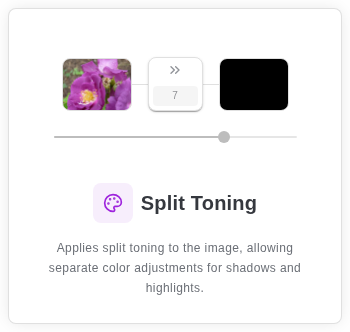

---

## Detail stages

### `sharpenStage(amount)`

**Node:** `sharpen` | **UI range:** `0..1000`, step `1`, default `0`.

Uses a four-neighbor unsharp kernel with `s=amount/100`:

$$C'=(1+4s)C-s(C_{left}+C_{right}+C_{up}+C_{down})$$

Interior pixels use direct indexing. Border pixels use edge-clamped sampling. The source image is copied before processing so neighboring samples are not affected by earlier writes. The function returns early for non-positive strength; RGB output is written to `ImageData`, and alpha is unchanged.

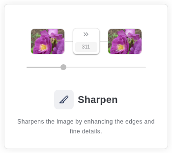

---

### `grainStage(amount)`

**Node:** `grain` | **UI range:** `0..1000`, step `1`, default `0`.

For each pixel, one random value is shared across RGB:

$$n=(random()-0.5)35(amount/100),\qquad C'=C+n$$

The stage returns early for non-positive amounts. It is intentionally nondeterministic and does not use a seeded generator. Byte writes clamp/round; alpha is preserved.

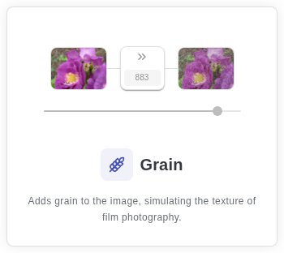

---

## Effects stages

### `vignetteStage(amount, color)`

**Node:** `vignette` | **UI range:** `amount 0..100`, step `1`, default `0`; `color` is an RGB triple with default `[0,0,0]` and no numeric slider config.

The radial falloff uses image-center distance and exponent `1.1`:

$$f=1-s\frac{(dx^2+dy^2)^{1.1}}{(cx^2+cy^2)^{1.1}},\qquad t=1-f$$

Each channel is blended with the supplied vignette color:

$$C'=Cf+color\,t$$

The implementation returns early for non-positive strength. It does not explicitly clamp `f` for direct out-of-range amounts, but byte assignment clamps/rounds. Color is expected in `0..255`.

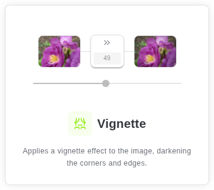

---

### `hdrEffectStage(amount, radius=12)`

**Node:** `hdr` | **UI ranges:** `amount 0..100`, step `1`, default `0`; `radius 0..90`, step `1`, default `0`.

The stage calculates luma, applies a separable box blur, and adds a scaled high-frequency detail signal:

$$boost=(Y-blur(Y))(amount/100)1.5$$

The blur radius is an integer window radius in the implementation. `boxBlur1D` clamps samples at image borders and performs horizontal then vertical passes. The stage returns early for non-positive amount, explicitly clamps each RGB result, and preserves alpha. Direct calls with an invalid or fractional radius are not normalized by the function and may produce incorrect loop behavior.

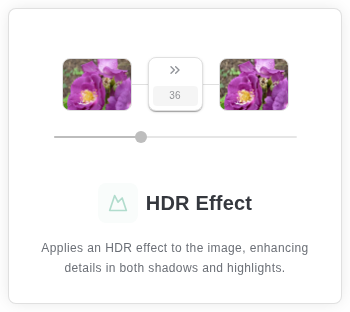

---

### `popStage(amount)`

**Node:** `pop` | **UI range:** `0..100`, step `1`, default `0`.

First applies contrast with `k=1+0.5(amount/100)`, then increases chroma around the resulting luma with `q=1+0.6(amount/100)`:

$$C_1=k(C-128)+128$$

$$C'=Y_1+(C_1-Y_1)q$$

The stage returns early for non-positive amounts. Both LUT and final RGB values are clamped/rounded. Alpha is preserved.

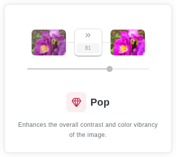

---

### `fadeStage(amount)`

**Node:** `fade` | **UI range:** `0..100`, step `1`, default `0`.

The fade curve lifts shadows and compresses contrast:

$$s=amount/100,\qquad C'=C(1-0.3s)+28s$$

The implementation uses a byte LUT. The function does not explicitly clamp `amount`, though the UI range is non-negative; output is rounded/clamped.

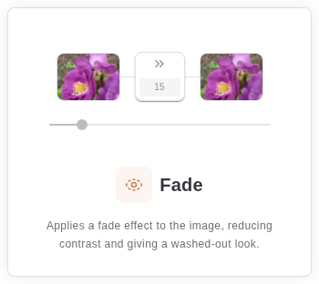

---

## Film stages

### `filmBaseRemoverStage(maskR, maskG, maskB, strength, densityCompensation, filmAge)`

**Node:** `film-base-remover` | **UI ranges:** `strength 0..100`, `densityCompensation 0..100`, and `filmAge 0..100`, all step `1`; defaults are `100`, `0`, and `0`. The mask color is an RGB triple with no numeric slider config and is expected in `0..255`.

The mask luminance is normalized to at least `1`, then each channel receives a correction ratio:

$$Y_m=max(1,0.2126R_m+0.7152G_m+0.0722B_m)$$

$$correction_c=Y_m/max(1,mask_c)$$

Strength is clamped to `0..1`, density compensation becomes a multiplicative exposure factor, and film age blends toward neutral luminance:

$$blend=clamp(strength/100),\qquad density=2^{clamp(densityCompensation)/100},\qquad age=clamp(filmAge/100)$$

The corrected channels are density-scaled, then age-dependent channel bias and luminance blending are applied. All final RGB channels are explicitly clamped. Direct mask channels are not clamped before ratio calculation.

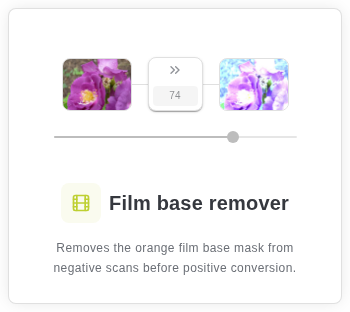

---

### `detectFilmBaseColor(imageData)`

This helper has no pipeline node or UI range. It builds a 256-bin luma histogram, finds a threshold containing the brightest 10% of pixels, and averages RGB values for pixels at or above that threshold. It returns an RGB triple in the byte-like `0..255` domain, or `[255,128,48]` when no pixels qualify. The result is used as a film mask fallback/detection value, not as a pixel-mutating stage.

## LUT stage

### `lutStage(lut)`

**Node:** `lut` | **UI:** no numeric slider; input is a parsed `.cube` LUT.

`parseCubeLut` accepts either a 1D or 3D LUT, never both, with a size of at least `2`. `DOMAIN_MIN` and `DOMAIN_MAX` default to `[0,0,0]` and `[1,1,1]` and must be strictly increasing per channel. The parser requires exactly `size * 3` values for a 1D LUT or `size^3 * 3` values for a 3D LUT.

For every input channel, normalized byte RGB is mapped into the declared domain and clamped to `0..1` before sampling. 1D LUTs use independent linear interpolation per channel. 3D LUTs use trilinear interpolation over the eight neighboring cube corners. Sampled output is clamped to unit range and converted back to bytes:

$$C'=255\,clampUnit(sample(C/255))$$

Invalid directives, sizes, domains, or row counts throw parser errors. Alpha is preserved by `lutStage`.

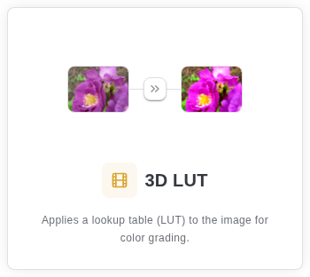

---

## Fixed transform

### `invertStage()`

**Node:** `invert` | **UI:** no numeric input.

Inverts each RGB byte independently:

$$C'=255-C$$

Alpha is preserved. Since the result is integral and in range for valid byte input, no additional explicit clamp is needed.

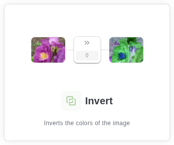

---

## Cross-cutting implementation notes

- `ImageData.data` is the final quantization boundary for most stages. Intermediate arithmetic is floating point, but assignments to the typed array produce byte output.
- Stages are composable but order-dependent. For example, applying exposure before contrast is not equivalent to the reverse order.
- Grain is random on every invocation, so repeated evaluations can differ even when all node parameters are unchanged.
- HDR allocates luma, temporary blur, and output arrays proportional to pixel count. Sharpen allocates a full source copy.
- No stage in this reference changes alpha; nodes that need transparency semantics must handle them separately.
