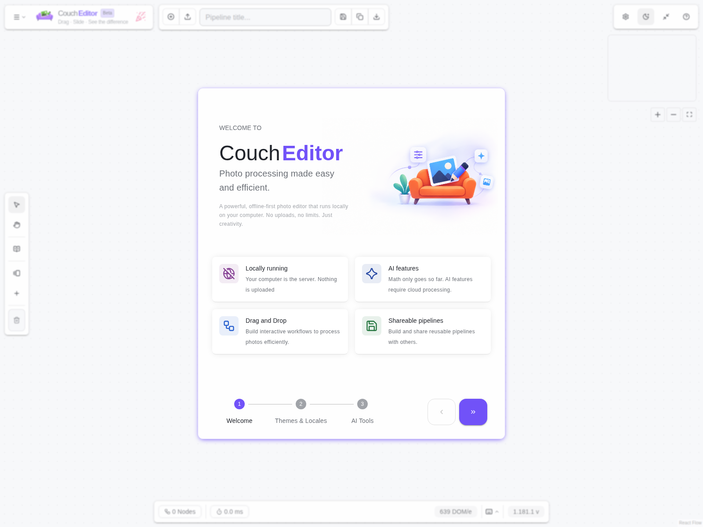
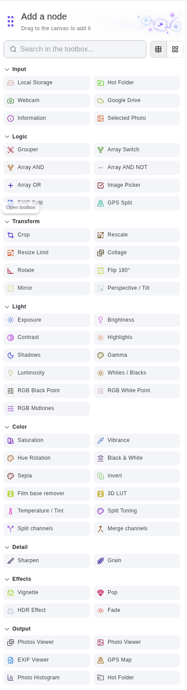
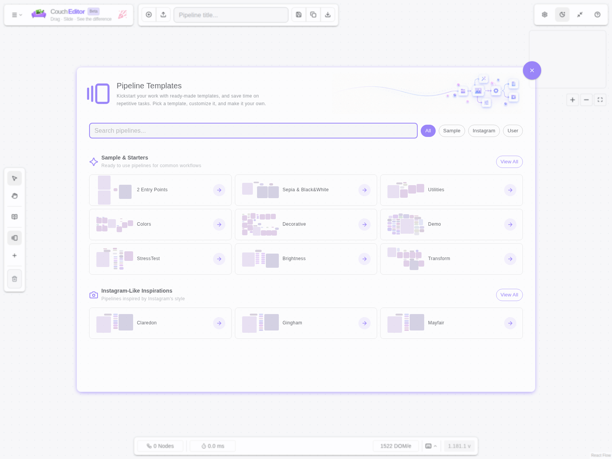
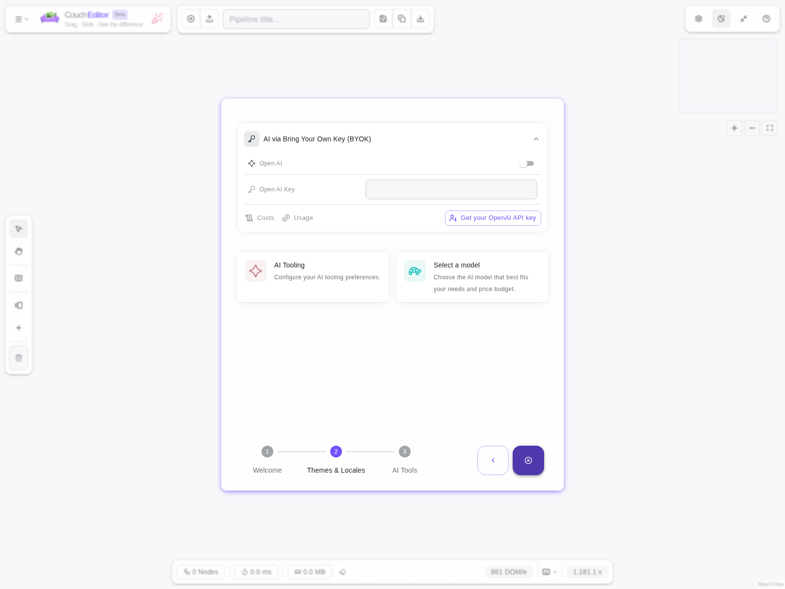
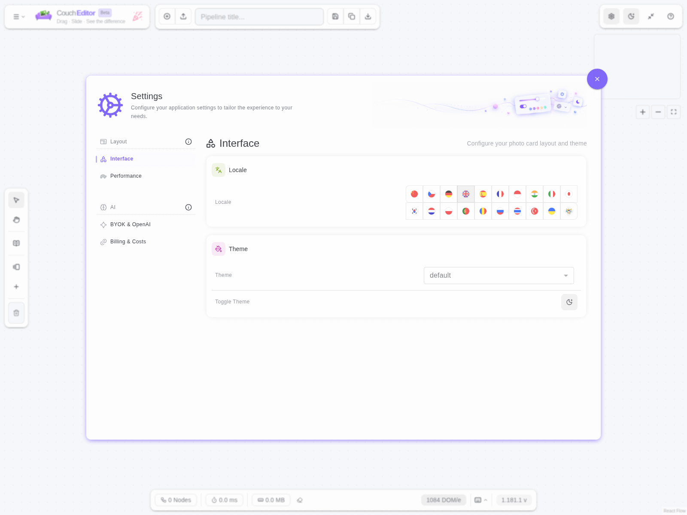
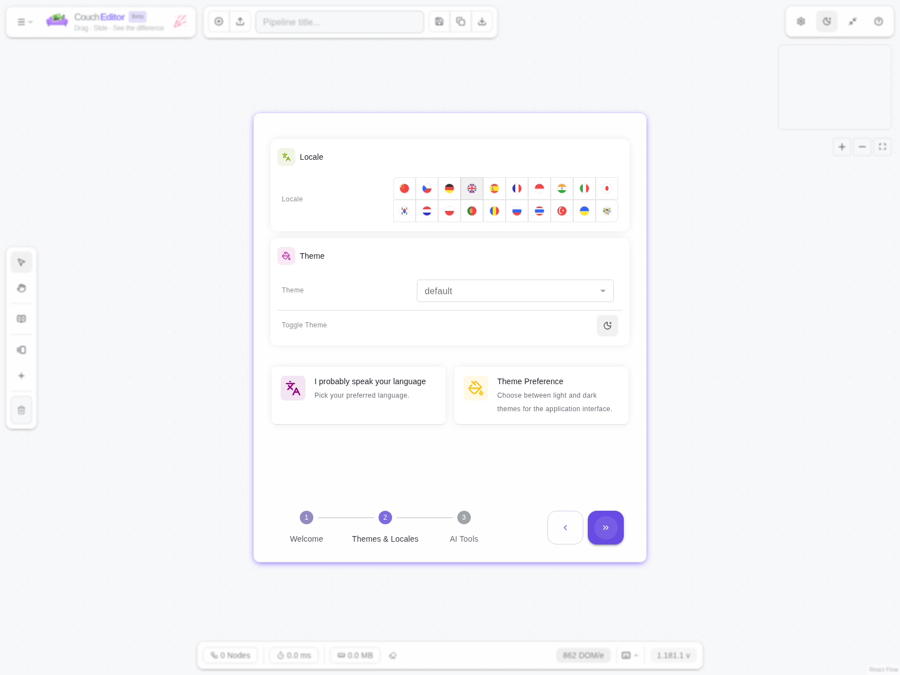
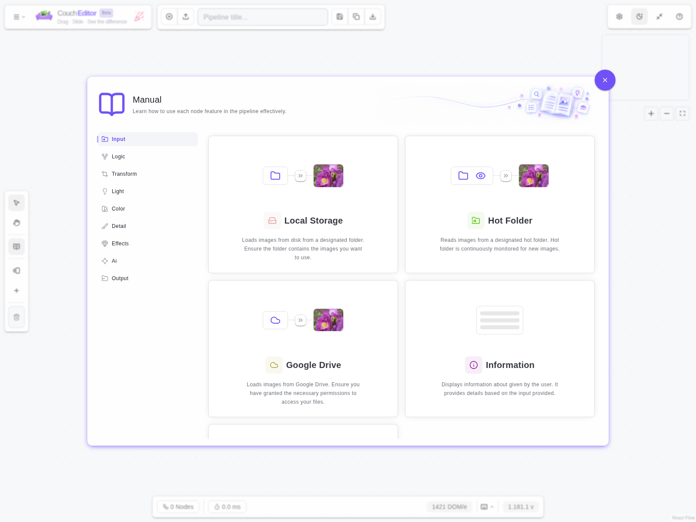

# CouchEditor


> Build reusable photo-editing recipes by arranging steps on a visual canvas.

CouchEditor lets you select photos, connect editing steps, preview the result, and save the workflow as a reusable `.cep` pipeline. The pipeline describes the edits; it does not alter your original files.



## 📸 What can I do with CouchEditor?

- Choose JPEG, PNG, or WebP photos from your computer.
- Arrange transforms, light and color adjustments, details, effects, and optional AI steps.
- Preview one photo or a complete set of photos.
- Inspect metadata, GPS information, and histograms where those outputs are useful.
- Download processed photos from a viewer or write them to a configured folder.
- Save a recipe in the browser, then export or import it as a `.cep` file.

## 🧩 How it works

A pipeline is a set of connected steps:

1. An **input** step provides photos or supporting information.
2. **Logic**, transform, and editing steps process or route that information.
3. An **output** step previews, inspects, or writes the result.

A typical pipeline looks like this:

`Photos -> Crop -> Brightness -> Viewer`

The safest way to begin is to connect a photo input directly to a viewer. Once the photos appear, add one editing step at a time and check the result after each change.

## 🚀 Getting started

1. Open CouchEditor.
2. Open the toolbox on the left if it is hidden.
3. Drag a photo input onto the canvas.
4. Select the photos you want to edit.
5. Drag an editing or transform step onto the canvas.
6. Drag a viewer onto the canvas.
7. Connect steps by dragging from an output connector to the next input connector.
8. Adjust the step controls and review the result in the viewer.

The toolbox includes a search field and supports dragging nodes onto the canvas. AI nodes are shown when AI features are enabled.



### Choosing photos

Use the local photo input to select images from your computer. The selected photo count and thumbnails are shown on the node. Other input nodes can provide a hot folder, Google Drive, selected-photo, information, or metadata-based workflow when those integrations fit your setup.

### Connecting and changing steps

Connect steps in the order you want them applied. To change a connection, drag its endpoint to another connector. To remove a connection, double-click it. To remove a node, drag it to the trash area or select it and press `Delete`.

## 🧰 Available toolkit

The toolbox groups nodes by purpose. Exact labels can vary with the active language and enabled features.

- **Input**: local storage, hot-folder input, Google Drive, information, and selected-photo sources.
- **Logic**: grouping, array switching and boolean operations, image picking, EXIF splitting, GPS splitting, and channel splitting or merging.
- **Transform**: crop, rescale, collage, rotate, flip, mirror, and perspective correction.
- **Light**: exposure, brightness, contrast, highlights, shadows, gamma, luminosity, whites and blacks, and RGB point controls.
- **Color**: saturation, vibrance, hue rotation, black and white, sepia, inversion, LUTs, temperature and tint, split toning, and film-base removal.
- **Detail**: sharpening, denoising, and grain.
- **Effects**: vignette, pop, HDR, and fade.
- **AI**: denoising, colorizing, negative conversion, AI photo editing, and Ask AI when AI is enabled and configured.
- **Output**: single-photo and multi-photo viewers, EXIF viewer, GPS map, histogram, and hot-folder output.

## 🔄 Common usage flows

### ⚡ Quick edit

Use this for a one-off adjustment:

`Local photos -> Transform or adjustment -> Single-photo viewer`

Connect a multi-photo viewer as well when you need to check the whole set before downloading it.

### 💾 Repeatable recipe

Use this when the same look or export process will be reused:

1. Build and test the pipeline.
2. Enter a descriptive pipeline title.
3. Select **Save** to store it in CouchEditor.
4. Use **Save as clone** before experimenting with a variation.
5. Use **Download pipeline** to export the recipe as a `.cep` file.
6. Use **Upload pipeline** to import the recipe on another browser or computer.
7. Select photos in the imported pipeline before running it.

The `.cep` file contains the recipe, not the original photos. Anyone importing it must provide their own source photos.



### 🔍 Inspect and understand a photo

Connect a source to the output that matches the question you are asking:

- Use a single-photo viewer to compare one result.
- Use a multi-photo viewer to review a complete set and download results together.
- Use the histogram to inspect tonal distribution.
- Use the EXIF viewer to inspect image metadata.
- Use the GPS map when the selected photos contain usable location data.

### 🤖 Optional AI editing

Enable AI features in the relevant settings and configure the required provider or key before adding AI nodes. AI availability depends on the installation and configuration. The AI onboarding screen shows the available setup state.



## 💾 Saving and sharing

Saved pipelines live in the browser where they were created. Clearing browser storage or switching browsers can remove access to them, so export important recipes as `.cep` files.

- **New** clears the current canvas for another recipe.
- **Save** stores the current recipe.
- **Save as clone** creates a separate copy while keeping the original.
- The pipeline selector loads a saved recipe.
- The trash action removes the selected saved recipe.
- **Download pipeline** exports the current recipe.
- **Upload pipeline** imports a `.cep` recipe.

## ⚙️ Settings, themes, and help

Settings contain application configuration and available personalization options. The built-in help view is useful when a control or workflow is unclear.







## 💡 Tips

- Start with a viewer connected directly to the photo input, then insert edits between them.
- Keep one pipeline focused on one look or task.
- Use names such as `Warm family photos` or `Web-size exports` for saved recipes.
- Save before a large experiment, or clone the recipe first.
- Export recipes that need to survive browser storage cleanup or be shared with someone else.

## 🛠️ For developers

CouchEditor is a Vite and React application.

Install dependencies and start the development server:

```bash
npm install
npm run dev
```

Useful commands:

```bash
npm run build    # Create a production build
npm run preview  # Build and serve a production preview
npm run lint     # Check the source code
```

The screenshot refresh command used by maintainers is:

```bash
npm run snaphot
```

## 🤝 Looking for collaborators

I am looking for collaborators, founders, and volunteers who are interested in building better tools for photo editing and creative workflows. Contributions can include product ideas, design, development, documentation, testing, or feedback.

If CouchEditor sounds interesting, open an issue or pull request to introduce yourself and share how you would like to help.

## 📄 License

See [LICENSE](LICENSE) for licensing information.


Build with love using Vite and React.
